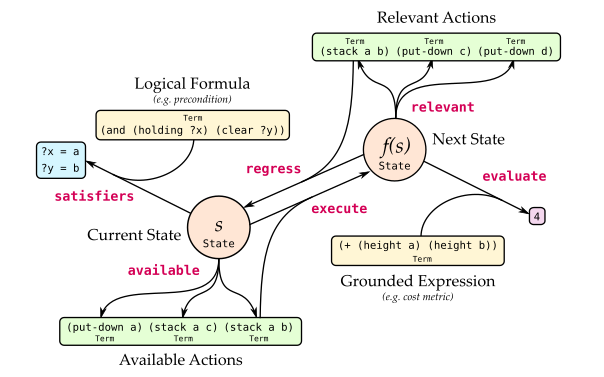

# Function Interface

PDDL.jl defines a set of interface functions that serve as basic operations in a wide variety of symbolic planning algorithms and applications. These functions are intended to be low-level enough such that planning algorithms can be expressed primarily in terms of the operations they represent, but high-level enough so as to abstract away from implementational details. A schematic overview of most of these interface functions is shown below.

```@raw html
<div style="text-align:center">
    
</div>
```

## Evaluating Formulae and Expressions

The key distinguishing feature of symbolic planning is the ability to describe and determine whether certain facts about the world hold true (e.g. is the robot holding a block?), or evaluate numeric properties (e.g. the distance between two cities), with queries expressed in terms of first-order logic. As such, PDDL.jl provides the following functions which satisfy or evaluate first-order expressions in the context of a [`State`](@ref):

### Formula Satisfaction

Given a term representing a well-formed logical formula, or a collection of `terms` (treated as conjunctions of such formulae), the [`satisfy`](@ref) function returns whether they are satisfiable within a domain and state:

```@docs
satisfy
```

When a term has free variables, [`satisfy`](@ref) returns true as long as one satisfying assignment exists. A related function, [`satisfiers`](@ref), returns a list of all satisfying assignments to such variables (a.k.a. substitutions), including the empty list when a variable-free formula is satisfied. If no satisfying assignments exist, `nothing` is returned:

```@docs
satisfiers
```

### Term Evaluation

Given a term representing a ground expression (i.e. one with no free variables), the [`evaluate`](@ref) function returns the value of that expression in the context of a domain and state:

```@docs
evaluate
```

For example, if `term` refers to a fluent, the value of the fluent is returned. Compound numeric expressions (e.g., the sum of two fluents) can also be evaluated.

## State Initialization and Transition

A PDDL domain specifies the transition dynamics of a first order symbolic model of the world, while a PDDL problem specifies the initial state and object set over which these dynamics are grounded. PDDL.jl thus provides functions for constructing an initial state for a domain and problem, and for simulating the transition dynamics:

### State Initialization

Given a domain and problem, the [`initstate`](@ref) function returns the initial state, the type of which is concrete subtype of [`State`](@ref):

```@docs
initstate
```

The type of the returned state may vary depending on the type of the domain or problem provided. For example, providing a compiled domain as an argument leads [`initstate`](@ref) to return a compiled state representation.

### State Transition

Given a domain, state and action, the [`transition`](@ref) function returns a successor state, including the effects of events and processes (as supported by [PDDL+](http://citeseerx.ist.psu.edu/viewdoc/download?doi=10.1.1.15.5965&rep=rep1&type=pdf)) and random sampling (in the case of [probabilistic PDDL](http://citeseerx.ist.psu.edu/viewdoc/download?doi=10.1.1.94.2335&rep=rep1&type=pdf)). To support future multi-agent extensions of PDDL.jl, [`transition`](@ref) may also accept a set of `actions` to be executed in parallel:

```@docs
transition
transition!
```

## Forward Action Semantics

A widely-used strategy in symbolic planning is forward state space search, guided by a planning heuristic. These algorithms are built upon two basic operations to search forward in state space: querying the actions that are available in any given state, and executing an action to generate a successor state. These operations can be performed using the following functions:

### Action Availability

Given a domain, state, action schema and action arguments, the [`available`](@ref) function returns whether the corresponding action is available in the specified state -- i.e. its precondition is fulfilled. An action may alternatively be provided as a [`Term`](@ref) (e.g. `pddl"(stack a b)"`):

```@docs
available(::Domain, ::State, ::Action, ::Any)
```

When [`available`](@ref) is called without specifying an action, it returns an iterator over all actions available in the specified state, effectively encapsulating the logic for node expansion in a search algorithm:

```@docs
available(::Domain, ::State)
```

### Action Execution

Given a domain, state, action schema and action arguments, the [`execute`](@ref) function returns the result of applying the specified action to the state. An action may also be provided as a [`Term`](@ref):

```@docs
execute
execute!
```

## Inverse Semantics

Regression-based planners (e.g. [the classical STRIPS algorithm](https://en.wikipedia.org/wiki/Stanford_Research_Institute_Problem_Solver)) make use of the fact that is possible to plan by working *backwards* from a goal, repeatedly selecting actions that are relevant to achieving a goal state or specification. This motivates the following interface methods for (i) constructing *abstract* states from goal specifications and (ii) exposing the *inverse* semantics of actions:

### Goal State Construction

In symbolic planning, a logical goal formula ``g`` effectively specifies the set of all concrete goal states where ``g`` holds true. We can represent this set of concrete states as an *abstract* state ``\bar s``. In the special case where the goal ``g`` contains no disjunctions or functions, ``\bar s`` can also be understood as a *partial* state that specifies the values of all predicates in ``g``, and leaves all other predicates unspecified.

To support regression search in this abstract space, PDDL.jl provides the [`goalstate`](@ref) method for constructing an abstract state from the goal specification of a problem:

```@docs
goalstate
```

As with [`initstate`](@ref), the data type of the returned state ``\bar s`` may depend on the type of domain or problem provided.

### Action Relevance

Given a domain, state, action schema and action arguments, the [`relevant`](@ref) function returns whether the action is relevant to achieving the specified state -- i.e., it achieves at least one predicate or numeric constraint in the state, and destroys none through deletion or modification. In the case where the action's effect reduces to a list of predicates to be added and a list to be deleted, this simplifies to checking that at least one added predicate is true in the state, and that none are deleted. An action may also be provided as a [`Term`](@ref):

```@docs
relevant(::Domain, ::State, ::Action, ::Any)
```

When `relevant` is called without specifying an action, it returns an iterator over all actions relevant to the specified state, encapsulating the logic for node expansion in a regression search algorithm:

```@docs
relevant(::Domain, ::State)
```

### Action Regression

Given a domain, state, action schema and action arguments, the [`regress`](@ref) function executes the action in reverse, returning a (potentially abstract) state that represents the pre-image of the action with respect to the input state. An action may also be provided as a [`Term`](@ref):

```@docs
regress
regress!
```
